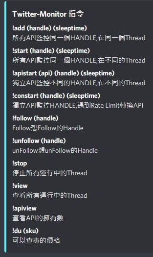
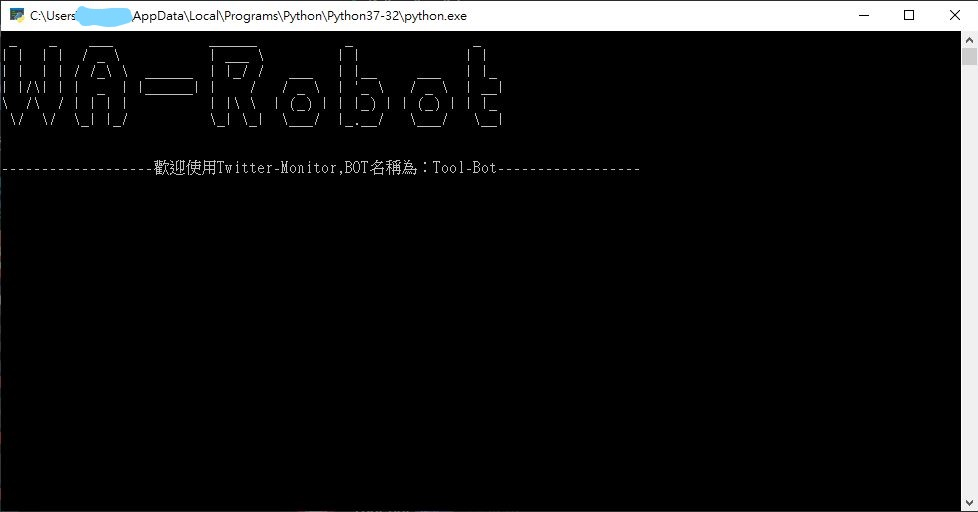

# Twitter-Monitor-Master

---

---

## 功能

- [x] Support Multi API
- [x] Monitor with Handle
- [x] Follow With Handle
- [x] unFollow With Handle
- [x] Stop all thread
- [x] View all thread
- [x] View Api count

---

## 運行

1. 修改 twitter-monitor-async-multi-api 定義部分的 WEBHOOK URL 以及最後一行的 Bot Token
2. 將 API 加入 Config.json
3. cmd 運行 python twitter-monitor-async-multi-api
